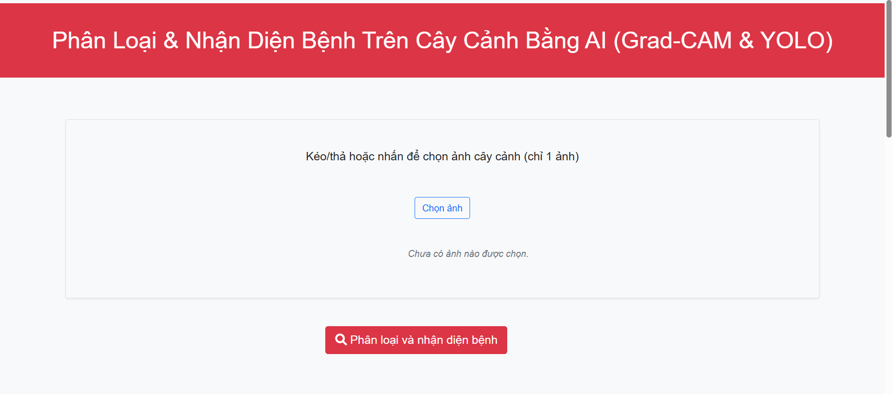
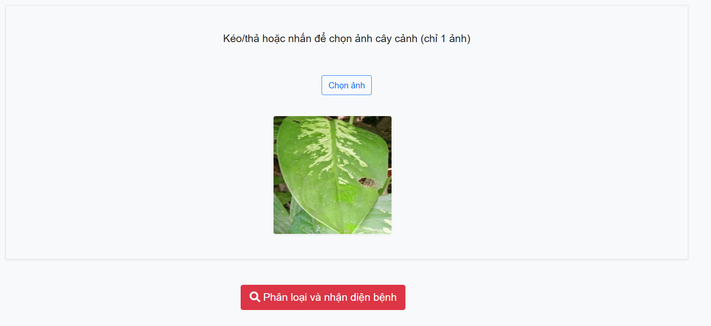
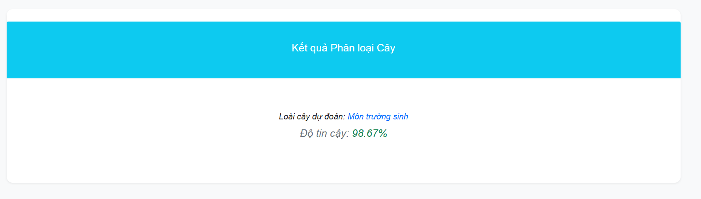
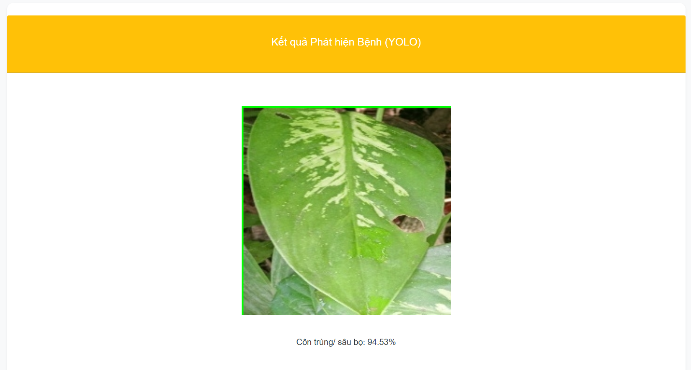
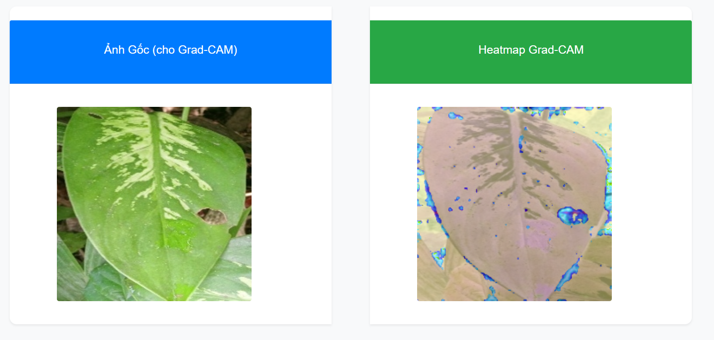
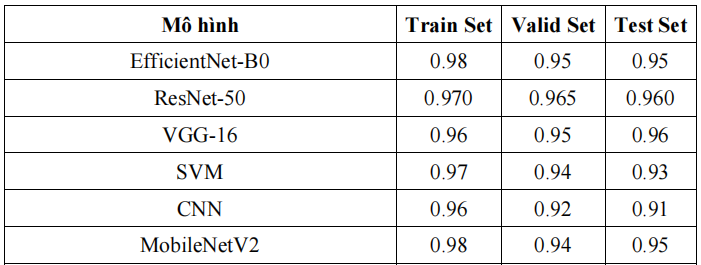
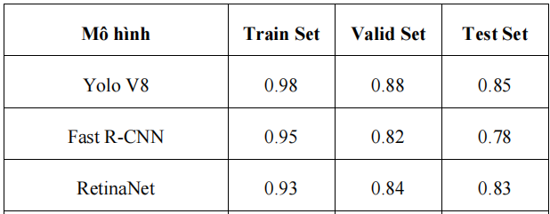

# 🪴 AI-Powered Plant Care: Classification & Disease Detection

Dự án Nghiên cứu Khoa học ứng dụng các thuật toán Học sâu (Deep Learning) để tự động hóa việc phân loại các loài cây cảnh và nhận diện sớm các loại bệnh trên lá. Hệ thống hỗ trợ người dùng không chuyên chăm sóc cây cảnh hiệu quả thông qua hình ảnh.

## 🚀 Điểm nổi bật kỹ thuật (Technical Highlights)
Phân loại loài cây: Nhận diện 16 loại cây cảnh phổ biến trong nhà (Trầu bà, Kim tiền, Lưỡi hổ, Lan ý, Phú quý...).

Phát hiện bệnh lý: Nhận diện và khoanh vùng 11 loại trạng thái bệnh như đốm lá, cháy mép lá, thán thư, rệp sáp, vàng lá....

Xử lý đa mô hình: Kết hợp các kiến trúc CNN tiên tiến để tối ưu hóa giữa độ chính xác và tốc độ xử lý trên thiết bị di động.

Giải thích mô hình: Tích hợp GradCAM++ để trực quan hóa vùng bệnh, giúp người dùng hiểu rõ tại sao AI đưa ra kết quả đó.

## 🛠️ Công nghệ sử dụng (Tech Stack)
Ngôn ngữ: Python 3.x 

Framework: Flask (Web App), TensorFlow, Keras, PyTorch 

Thư viện: OpenCV (xử lý ảnh), Scikit-learn, Matplotlib 

Công cụ gán nhãn: CVAT (với định dạng COCO JSON) 

## 📂 Luồng xử lý chính

## 🚀 Kiến trúc hệ thống
Dự án triển khai và so sánh hai nhóm mô hình chính:

Phân loại cây (Classification): EfficientNet-B0, ResNet-50, VGG-16, MobileNetV2, CNN và SVM.

Nhận diện bệnh (Object Detection): YOLOv8, Fast R-CNN và RetinaNet.

## 🖼️ Demo & Kết quả thực nghiệm
### Giao diện hệ thống
Khi người dùng chưa tải ảnh lên, giao diện hiển thị khung tương tác chính với nút “Phân loại và nhận diện bệnh”, cho phép người dùng kéo/thả hoặc nhấn để chọn ảnh từ thiết bị.

### Kết quả phân loại 
Sau khi xử lý ảnh, ứng dụng hiển thị tên loại cây được dự đoán cùng với độ tin cậy.

### Kết quả nhận diện
Tiếp theo, hệ thống sử dụng mô hình YOLO để phát hiện các vùng bệnh trên lá cây.

### Phân tích trực quan với XGrad-CAM
Cuối cùng, ứng dụng sử dụng Grad-CAM để tạo bản đồ nhiệt (heatmap) trực quan, giúp người dùng thấy rõ vùng ảnh có ảnh hưởng nhiều đến dự đoán bệnh.

## 📊 Kết quả thực nghiệm
### Kết quả phân loại cây

Qua thực nghiệm, các kiến trúc Deep Learning như EfficientNet-B0 và ResNet-50 cho thấy sự ổn định vượt trội với độ chính xác tập Test đạt 95% - 96%. Kết quả này khẳng định khả năng trích xuất đặc trưng hình ảnh mạnh mẽ của các mạng tích chập hiện đại đối với dữ liệu thực vật. Đặc biệt, việc các mô hình nhẹ như MobileNetV2 vẫn duy trì được độ chính xác cao (95%) cho thấy tiềm năng triển khai thực tế trên các thiết bị di động với tài nguyên hạn chế.

### Kết quả nhận diện bệnh

Trong bài toán phát hiện vị trí bệnh lý, mô hình YOLOv8 thể hiện ưu thế tuyệt đối với độ chính xác tập huấn luyện lên tới 98% và duy trì 85% trên tập kiểm thử. Khả năng khoanh vùng chính xác các vết đốm lá, rỉ sắt hay rệp sáp giúp hệ thống không chỉ đưa ra chẩn đoán mà còn hỗ trợ người dùng định vị cụ thể khu vực cần xử lý. So với RetinaNet hay Fast R-CNN, YOLOv8 cung cấp sự cân bằng tốt nhất giữa tốc độ xử lý (Real-time) và độ tin cậy trong điều kiện dữ liệu thực tế.

